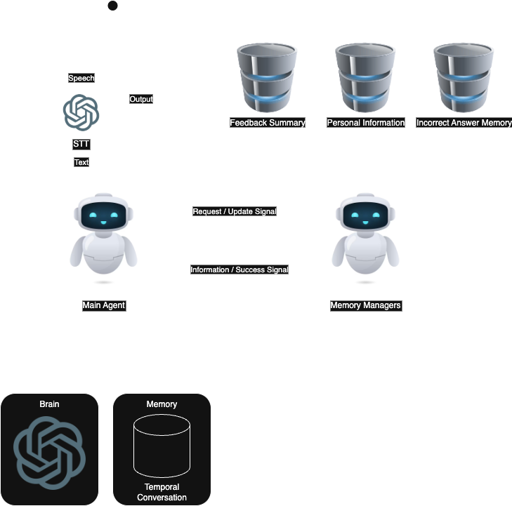

# Talky - English Conversation Agent
 
### Why did I choose an agent architecutre instead of a llm?

1. This service should use a multiple DB(Memory).
2. This service should give an advice for user in a flexible manner.

### Todo

- [ ] Implementation Agent 
- [ ] Implementation Memory
- [ ] Implementation Test Dataset (for evaluation)

### Architecture

1. Memory
    - User Feedback Memory
        1. Feedback Memory -> The whole of user feedback is saved.
        2. Feedback Summary Memory -> The agent checks this memory for useful conversation.
    - User Conversation Memory
        1. Conversation Memory -> The whole of user conversation is saved.
        2. Personal Information Memory -> The agent checks this memory to provide more interesting conversation.
            - This memory keeps :
                1. User basic information : age, education, job, hobby, speciality, address etc.
                2. User conversation pattern : frequently used expressions.
                3. User interest : Topics and fields that users are interested in
    - Teacher Memory :
        1. Incorrect Answer Memory -> The whold of user incorrect answer.

2. Agent

- User can say in english or korean.
- When user say any sentence, STT model convert speech to text. then the text is transfered main agent.
- The main agent's main role is anlyzing text user spoke. 
    - if text is korean, main agents translate in english. 
    - if text is english, there are two cases. 
        - one case is text's grammar is incorrect. 
            - At this point, the agent corrects the incorrect sentence.
        - the other case is text's grammar is correct.
            - At this point, the agent checks to see if there is a better expression and improves it.
- Then when memory managers are used?
    - It is simple. the main agent asks for the information it needs to analyze the text.
        - At this point, switcher(router) is used for routing to proper Manager.
- Memory Managers Role
    1. When Main Agent asks for updating the memory with new data, Memory Managers update memory.
    2. When Main Agent asks for the information, Memory Managers transfer proper information.